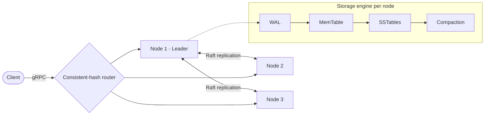
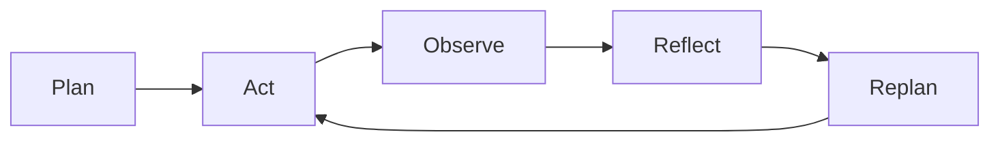

<!-- Repo name must be exactly: anirudhkrishna-06/anirudhkrishna-06 -->

 

 

  

---

## 👋 Hey, I'm Anirudh

Final-year **B.Tech IT** student at **SSN College of Engineering, Chennai**, and an engineer who likes understanding *why* things work before using them. This summer I interned at **Amazon** as an SDE on a payments microservice, where correctness isn't optional. Outside work, I build databases from scratch, teach LLMs to be less confidently wrong, and play the **mridangam** professionally.

> 🥁 In Carnatic music, you keep the *tala* (the rhythm cycle) no matter how wild the improvisation gets.
> Good systems work the same way: a steady core, with room to improvise on top.

---

## 🎼 My Work, Arranged Like a Concert

Carnatic concerts have a structure. So does my work.

| Part of the concert | What it means | In my world |
|---|---|---|
| **Varnam** (the warm-up) | Fundamentals, drilled until they're muscle memory | 300+ LeetCode problems, DSA, OOD, database systems |
| **Kriti** (the main piece) | The composition that carries the show | Production-minded backend work: Java, Spring Boot, AWS |
| **Manodharma** (improvisation) | Creative exploration within rules | Agentic AI, RAG, and multi-agent planning experiments |
| **Tani Avartanam** (the solo) | Percussion takes center stage | Building a storage engine in Go, from the WAL up |

---

## 🔭 What I'm Building Right Now

### 🗄️ AtlasKV: a distributed key-value store from scratch
`Go` · `gRPC` · `Protocol Buffers` · `Raft` · `LSM Trees`

No database library, just first principles: **write-ahead log → MemTable → SSTables → compaction → crash recovery**, then consistent-hash partitioning and replication across 3–5 nodes, with an existing Raft library handling leader election and log replication.

---

## 🚀 Projects

### 🧭 Routivity: geo-temporal agentic route intelligence
`Python` · `React Native` · `Firebase`

A multi-agent travel planner that thinks backwards. It **reverse-plans** from a fixed arrival time to work out when you should leave, factoring in route time, meal windows and restaurant scores, then adapts mid-route using weather and location signals. (Tested on a simulated 320 km, four-segment Chennai to Kancheepuram trip.)

### 🧮 Calcmate: structure-aware AI for math learning
`Python` · `DSPy` · `RAG` · `LLMs` · `Reinforcement Learning`

A math tutor that doesn't just *chat* about math. It turns word problems into symbolic equations and solution graphs, so LLM reasoning is grounded in deterministic computation. Each student step is validated against the graph to pinpoint exactly where a misconception begins, and an RL-based engine finds weak spots to drive adaptive quizzes.

---

## 💼 Experience

**Amazon · Software Development Engineer Intern** · May 2026 – Jul 2026 · Chennai
- Built agentic AI tools for code-review assistance, documentation maintenance and engineer onboarding on a payments microservice, delivering all 6 planned deliverables, including 2 stretch goals
- Designed a pointer-based agent memory layer to prevent data drift, informed by a study of 15+ production agents
- Raised test coverage on target components from ~35% to 95%+ and completed 21+ code reviews
- Built an on-call triage system and root-caused security defects using CloudWatch logs and git history

---

## 🛠️ Toolbox

**AWS in practice:** CDK · CloudWatch · DynamoDB · Lambda  
**Core CS:** Data Structures & Algorithms · Database Systems · Object-Oriented Design · System Design

---

## 📊 By the Numbers

---

## 🏆 Beyond the Code

- 🥇 **Department Rank 1** (current), B.Tech IT, CGPA 8.99/10
- 🏁 **Smart India Hackathon**: represented my college in 2024 and 2025
- 👁️ **Head of Pixel Perception** (Computer Vision Club): led a 12-member team and technical events with 60+ attendees
- 🥁 **Professional Carnatic mridangist** with 10+ concerts

---

## 💬 Let's Talk

Always up for conversations about **distributed systems, storage engines, agentic AI, or Carnatic rhythm**, and how they're weirdly similar.

📬 **anikrishofficial@gmail.com** · 📍 Chennai, India

